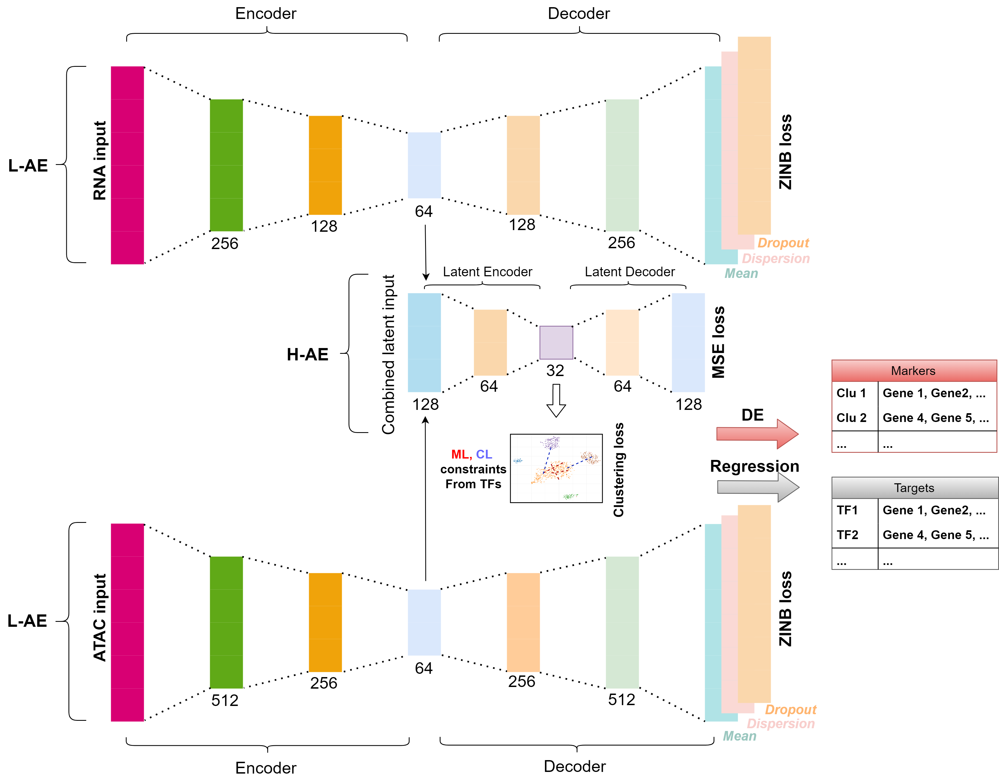
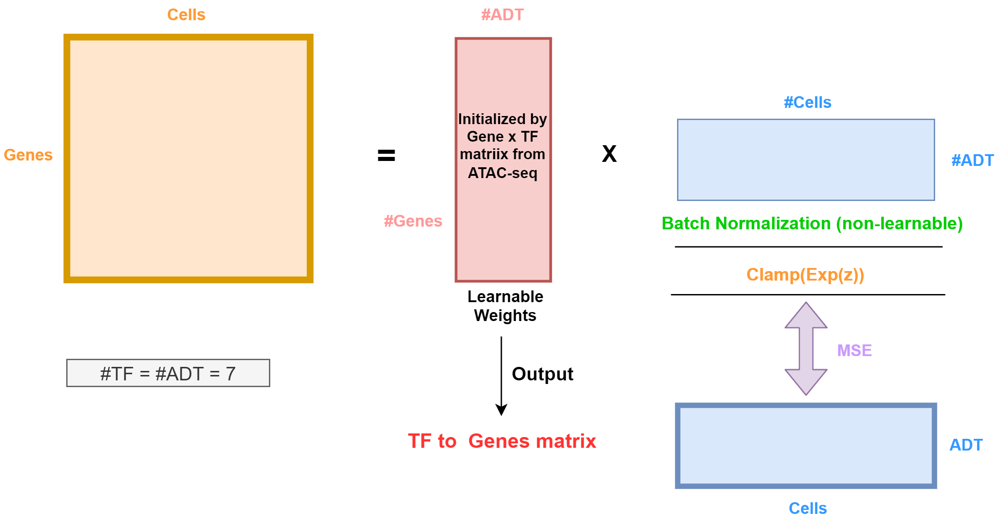

# Multi-SC

## Description
Our pipeline leverages a multimodal constraint autoencoder (scHCAE) to integrate the multiomics data during the clustering process and a matrix factorization-based model (scMF) to predict target genes regulated by a TF.

### Architectural of scHCAE

### Architectural of scMF


## Usage
### Prerequisites
- Python 3.8 or higher
- Required packages: `torch`, `sklearn`, `scipy`, `scanpy`, `h5py`, `numpys`, `pandas`

### Setup
```bash
git clone https://github.com/xianglin226/Multi-SC.git
```

### Running scHCAE
To run the scHCAE for clustering with a specified number of clusters, use the following command:
```bash
python -u run_scMultiCluster3.py \
 --n_clusters 6 \
 --data_file GSE178707_neatseq_lane1.h5
```

### Running scMF
To predict target genes regulated by TFs using scMF, run:
```bash
python -u run_scMF.py \
 --data_file processedinput_scMF_lane1.h5
```

## Example Data
The example data can be access [here](https://drive.google.com/drive/folders/1Sq0w03-tFc-fcv-Y1i9XmL4TIxkoLCKq?usp=share_link).  

### Clustering Data
GSE178707_neatseq_lane1.h5\
GSE178707_neatseq_lane2.h5\
GSM5123951_TEAseq_well1.h5

#### Structure
  - `X1`: Gene expression data (RNA)
  - `X2`: Protein expression data (ADT)
  - `X3`: Chromatin accessibility data (ATAC)
  - `X4`: Chromatin accessibility data (ATAC) mapped to gene features
  - `Genes`: Gene features (rows of `X1`)
  - `ADT`: Surface protein features (rows of `X2`)
  - `Peaks`: Peak features (rows of `X3`)
  - `GeneFromPeaks`: Gene features (rows of `X4`)
  - `Barcode`: Cell barcodes

### MF Data
processedinput_scMF_lane1.h5\
processedinput_scMF_lane1.h5
  - `B`: ADT-to-cell matrix
  - `W`: Gene-to-ADT matrix
  - `X`: Cell-to-gene matrix
